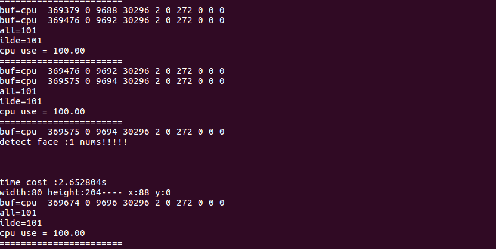

#### 更新：2017/11/09 做了neon加速和优化,arm上速度500~800ms.程序占用内存10MB左右。基本可以落地。但最新版本不提供。
## 嵌入式人脸检测
  
  
#### 文件说明：
* 1.test.cpp:封装的一层可以由c语言调用的接口,各位可以自己设计，我只提供参考。
* 2.face_test.c:C语言调用接口，各位可以类似的在各个嵌入式设备上取出yuv数据(y分量)调用接口。
* 3.cpu_use.c:是查看嵌入式设备的cpu占有率，跑程序的时候可以开个线程监控cpu

#### 参考效果：
  > 输入：352x288
                                    最小窗口：30
                                    步长：4
                                     时间 2~3秒.
可以调步长在结合移动侦测也可以落地使用

  
